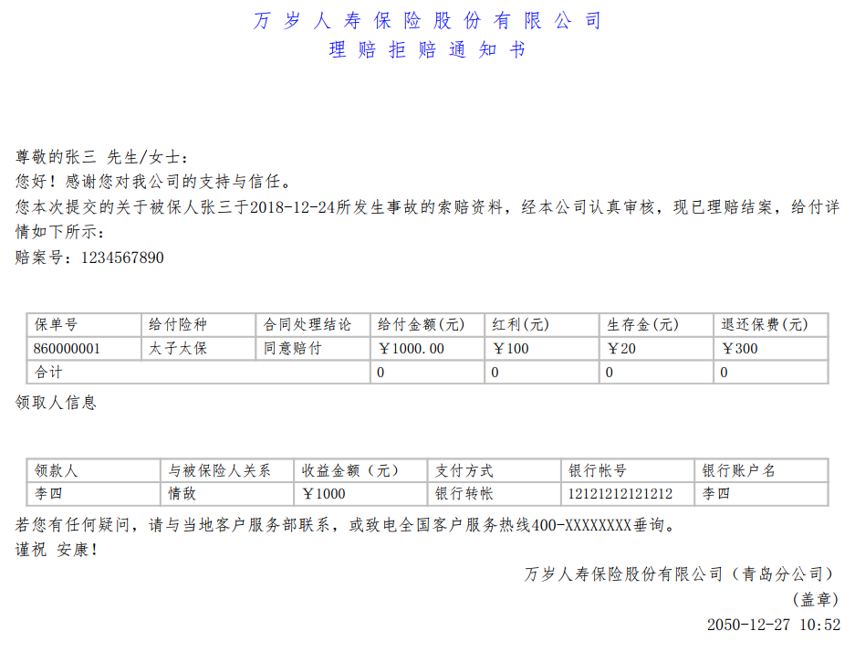
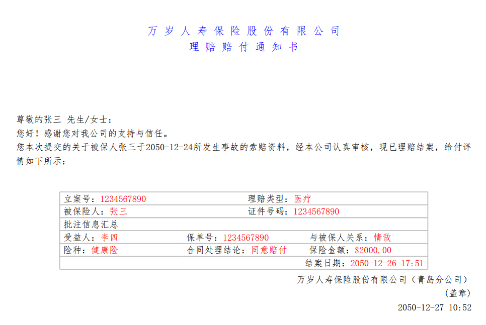

# Fork from easytable

This is a (very) small project that builds upon easytable, but borrow some API fashion from iText.

## Example
In order to produce a whole PDF document with a table that looks like this one:

You just need [this code](src/test/java/org/vandeseer/integrationtest/DenyClaimNotice.java). :

        final PDFont FONT = BoxDocument.loadFontFromResource("simfang.ttf");
    	
        BoxDocument boxDocument = new BoxDocument(FONT);
        
        boxDocument.add(new BoxParagraph("万 岁 人 寿 保 险 股 份 有 限 公 司", HorizontalAlignment.CENTER, FONT, 12, Color.BLUE));

        boxDocument.add(new BoxParagraph("理 赔 拒 赔 通 知 书", HorizontalAlignment.CENTER, FONT, 12, Color.BLUE));

        boxDocument.add(" ");
        boxDocument.add(" ");
        boxDocument.add(" ");
        
        boxDocument.add("尊敬的张三 先生/女士：");

        boxDocument.add("您好！感谢您对我公司的支持与信任。");

        boxDocument.add("您本次提交的关于被保人张三于2018-12-24所发生事故的索赔资料，经本公司认真审核，现已理赔结案，给付详情如下所示：");

        boxDocument.add("赔案号：1234567890");

        BoxTable boxTable = new BoxTable(7, 480, FONT);
        
        boxTable.addCell("保单号");
        boxTable.addCell("给付险种");
        boxTable.addCell("合同处理结论");
        boxTable.addCell("给付金额(元)");
        boxTable.addCell("红利(元)");
        boxTable.addCell("生存金(元)");
        boxTable.addCell("退还保费(元)");

        boxTable.addCell("860000001");
        boxTable.addCell("太子太保");
        boxTable.addCell("同意赔付");
        boxTable.addCell("￥1000.00");
        boxTable.addCell("￥100");
        boxTable.addCell("￥20");
        boxTable.addCell("￥300");

        BoxCell boxCell = new BoxCell("合计");
        boxCell.setColspan(3);
        boxTable.addCell(boxCell);

        boxTable.addCell("0");
        boxTable.addCell("0");
        boxTable.addCell("0");
        boxTable.addCell("0");

        boxTable.flush();
        
        boxDocument.add(boxTable);

        boxDocument.add("领取人信息");

        BoxTable boxTable2 = new BoxTable(6, 480, FONT);
        boxTable2.addCell("领款人");
        boxTable2.addCell("与被保险人关系");
        boxTable2.addCell("收益金额（元）");
        boxTable2.addCell("支付方式");
        boxTable2.addCell("银行帐号");
        boxTable2.addCell("银行账户名");
        
        boxTable2.addCell("李四");
        boxTable2.addCell("情敌");
        boxTable2.addCell("￥1000");
        boxTable2.addCell("银行转帐");
        boxTable2.addCell("12121212121212");
        boxTable2.addCell("李四");
        
        boxTable2.flush();

        boxDocument.add(boxTable2);

        boxDocument.add("若您有任何疑问，请与当地客户服务部联系，或致电全国客户服务热线400-XXXXXXXX垂询。");

        boxDocument.add("谨祝 安康！");
        
        boxDocument.add(new BoxParagraph("万岁人寿保险股份有限公司（青岛分公司）", HorizontalAlignment.RIGHT, FONT, 10));
        
        boxDocument.add(new BoxParagraph("(盖章)", HorizontalAlignment.RIGHT, FONT, 10));
        
        boxDocument.add(new BoxParagraph("2050-12-27 10:52", HorizontalAlignment.RIGHT, FONT, 10));

        boxDocument.save(OUTPUT_FILE_NAME);
        
And in order to produce a whole PDF document with a table that looks like this one:

You will need  [this code](src/test/java/org/vandeseer/integrationtest/AcceptClaimNotice.java). :

        final PDFont FONT = BoxDocument.loadFontFromResource("simfang.ttf");
    	
        BoxDocument boxDocument = new BoxDocument(FONT);
        
        BoxTable boxTableN = new BoxTable(2, 400, FONT, 10, 0);
        boxTableN.setRowJustNeedBottom(true);
        BoxParagraph p = new BoxParagraph("立案号：", HorizontalAlignment.LEFT, FONT, 10);
        BoxParagraph pSub = new BoxParagraph("1234567890", HorizontalAlignment.LEFT, FONT, 10, Color.RED);
        p.addParagraph(pSub);
        
        boxTableN.addCell(p);
        
        BoxParagraph p1 = new BoxParagraph("理赔类型：", HorizontalAlignment.LEFT, FONT, 10);
        BoxParagraph p1Sub = new BoxParagraph("医疗", HorizontalAlignment.LEFT, FONT, 10, Color.RED);
        p1.addParagraph(p1Sub);
        
        boxTableN.addCell(p1);
        
        BoxParagraph p2 = new BoxParagraph("被保险人：", HorizontalAlignment.LEFT, FONT, 10);
        BoxParagraph p2Sub = new BoxParagraph("张三", HorizontalAlignment.LEFT, FONT, 10, Color.RED);
        p2.addParagraph(p2Sub);
        
        boxTableN.addCell(p2);
        
        BoxParagraph p3 = new BoxParagraph("证件号码：", HorizontalAlignment.LEFT, FONT, 10);
        BoxParagraph p3Sub = new BoxParagraph("1234567890", HorizontalAlignment.LEFT, FONT, 10, Color.RED);
        p3.addParagraph(p3Sub);
        
        boxTableN.addCell(p3);
        
        boxTableN.flush();
        
        BoxTable boxTableM = new BoxTable(3, 400, FONT, 0, 20);
        boxTableM.setRowJustNeedBottom(true);
        
        BoxParagraph head = new BoxParagraph("批注信息汇总", HorizontalAlignment.LEFT, FONT, 10);
        BoxCell boxCellHead = new BoxCell(head);
        boxCellHead.setColspan(3);
        boxCellHead.setHorizontalAlignment(LEFT);
        boxTableM.addCell(boxCellHead);
        
        BoxParagraph pM1 = new BoxParagraph("受益人：", HorizontalAlignment.LEFT, FONT, 10);
        BoxParagraph pM1Sub = new BoxParagraph("李四", HorizontalAlignment.LEFT, FONT, 10, Color.RED);
        pM1.addParagraph(pM1Sub);
        
        boxTableM.addCell(pM1);
        
        BoxParagraph pM2 = new BoxParagraph("保单号：", HorizontalAlignment.LEFT, FONT, 10);
        BoxParagraph pM2Sub = new BoxParagraph("1234567890", HorizontalAlignment.LEFT, FONT, 10, Color.RED);
        pM2.addParagraph(pM2Sub);
        
        boxTableM.addCell(pM2);
        
        BoxParagraph pM3 = new BoxParagraph("与被保人关系：", HorizontalAlignment.LEFT, FONT, 10);
        BoxParagraph pM3Sub = new BoxParagraph("情敌", HorizontalAlignment.LEFT, FONT, 10, Color.RED);
        pM3.addParagraph(pM3Sub);
        
        boxTableM.addCell(pM3);
        
        BoxParagraph pM11 = new BoxParagraph("险种：", HorizontalAlignment.LEFT, FONT, 10);
        BoxParagraph pM11Sub = new BoxParagraph("健康险", HorizontalAlignment.LEFT, FONT, 10, Color.RED);
        pM11.addParagraph(pM11Sub);
        
        boxTableM.addCell(pM11);
        
        BoxParagraph pM12 = new BoxParagraph("合同处理结论：", HorizontalAlignment.LEFT, FONT, 10);
        BoxParagraph pM12Sub = new BoxParagraph("同意赔付", HorizontalAlignment.LEFT, FONT, 10, Color.RED);
        pM12.addParagraph(pM12Sub);
        
        boxTableM.addCell(pM12);
        
        BoxParagraph pM13 = new BoxParagraph("保险金额：", HorizontalAlignment.LEFT, FONT, 10);
        BoxParagraph pM13Sub = new BoxParagraph("$2000.00", HorizontalAlignment.LEFT, FONT, 10, Color.RED);
        pM13.addParagraph(pM13Sub);
        
        boxTableM.addCell(pM13);
        
        BoxParagraph tail = new BoxParagraph("结案日期：", HorizontalAlignment.LEFT, FONT, 10);
        BoxParagraph tailSub = new BoxParagraph("2050-12-26 17:51", HorizontalAlignment.LEFT, FONT, 10, Color.RED);
        tail.addParagraph(tailSub);
        BoxCell boxCellTail = new BoxCell(tail);
        boxCellTail.setColspan(3);
        boxCellTail.setHorizontalAlignment(RIGHT);
        boxTableM.addCell(boxCellTail);
        
        boxTableM.flush();
        
        boxDocument.add(new BoxParagraph("万 岁 人 寿 保 险 股 份 有 限 公 司", HorizontalAlignment.CENTER, FONT, 12, Color.BLUE));

        boxDocument.add(new BoxParagraph("理 赔 赔 付 通 知 书", HorizontalAlignment.CENTER, FONT, 12, Color.BLUE));

        boxDocument.add(" ");
        boxDocument.add(" ");
        boxDocument.add(" ");
        boxDocument.add(" ");
        
        boxDocument.add("尊敬的张三 先生/女士：");

        boxDocument.add("您好！感谢您对我公司的支持与信任。");

        boxDocument.add("您本次提交的关于被保人张三于2050-12-24所发生事故的索赔资料，经本公司认真审核，现已理赔结案，给付详情如下所示：");

        boxDocument.add(boxTableN);
        
        boxDocument.add(boxTableM);
        
        boxDocument.add(new BoxParagraph("万岁人寿保险股份有限公司（青岛分公司）", HorizontalAlignment.RIGHT, FONT, 10));
        
        boxDocument.add(new BoxParagraph("(盖章)", HorizontalAlignment.RIGHT, FONT, 10));

        boxDocument.add(new BoxParagraph("2050-12-27 10:52", HorizontalAlignment.RIGHT, FONT, 10));
        
        boxDocument.save(OUTPUT_FILE_NAME);

## Q&A
